#  C++学习笔记

[toc]

# Modern C++

## 智能指针

### shared_ptr

> 指向内存的指针个数为0时自动释放该内存

```cpp
//@初始化
shared_ptr<int> p=make_shared<int>(100);//(值为100)推荐（可用auto）
shared_ptr<int[]> p=make_shared<int[]>(100);//数组大小100
shared_ptr<int> ptr{new int[100]};
```

```cpp
p.use_count()//返回指针所指向内存的指针个数
```

```cpp
shared_ptr<MyClass> ptr(new MyClass, [](MyClass* ptr) {
    ptr->close();
    delete ptr;
});//使用lambda表达式自定义deleter
```

### unique_ptr

> 独享一块内存控制权，不支持拷贝与复制

```cpp
unique_ptr<int> p=make_unique<int>();//初始化（可用auto）
unique_ptr<int> p2(p.release());//将p指向的内存的控制权转交给p2
unique_ptr<int> p2=move(p);//将p指向的内存的控制权转交给p2
```

```cpp
std::unique_ptr<int, std::function<void(int*)>> ptr(
        new int(42),
        [](int* p) { std::cout << "Deleting value: " << *p << std::endl; delete p; }
    );//使用lambda表达式自定义deleter(第二个参数函数的参数与指针数据类型相同)
```

### weak_ptr

> 主要用途是避免循环引用(弱指针类型)
>
> 需要用一个shared_ptr实例来初始化weak_ptr(不会影响到shared_ptr的引用计数值)

```cpp
struct ObjB;
struct ObjA {
  void setObjB(std::shared_ptr<ObjB> pb) { b = pb; }
  std::shared_ptr<ObjB> b;
};
struct ObjB {
  void setObjA(std::shared_ptr<ObjA> pa) { a = pa; }
  std::shared_ptr<ObjA> a;
};
int main() {
  std::shared_ptr<ObjA> pa = std::make_shared<ObjA>();
  std::shared_ptr<ObjB> pb = std::make_shared<ObjB>();
  pa->setObjB(pb);
  pb->setObjA(pa);
  return 0;
}
//pa和pb构成循环依赖，main函数结束仍然不会释放pa，pb，造成内存泄漏
//可将ObjA中的shared_ptr改为weak_ptr以解决（语法同shared_ptr)
```

## lambda表达式

```cpp
[捕获变量](参数列表){函数主体}
auto f = [ ]{cout<<"hi\n";}//无参数
```

> 常用捕获规则

```cpp
[&]//按引用捕获所有变量
[=]//按值捕获所以变量 
[&,=N]//除了N按值捕获，其他都按引用捕获（顺序不影响）
[=,&N]//除了N按引用捕获，其他都按值捕获（顺序不影响）
[this]//在Class中使用
[*this] //C++17引入
[K=5]//新建并初始化一个变量K，类型自动推倒
```

## 数量不定的模版参数

> 

```cpp
void print() {
}
template <typename K, typename... T>
void print(const K& str1, const T&... str2) {
  cout << str1 << endl;
  print(str2...);
}
```

## 基于范围的循环

```cpp
vector<int> a;
for(auto e:a) cout<<e<<' ';
for(auto& e:a) e*=3;
```


------


# STL标准库

## 容器

### 容器通用功能


### string

#### erase删除

`s.erase(x,y)` 表示将字符串s从x位置起删除y个字符**(不填y默认为1)**

#### insert插入

`s.insert(x,y)` 表示将字符串y（或字符y）插入到s的x位置处

#### push_back末尾插入

`s.push_back(x)` 表示在s的末尾插入**字符**x

#### substr获取子字符

` string sub = str.substr(1, 3);`表示获取从第 2 个字符开始长度为 3 的字符串  

`string sub = str.substr(1);`表示获取从第2个字符开始到最后的字符串

### vector

#### 初始化

`vector<int> a;` <数据类型>

#### erase删除

`s.erase(x,y)` 表示将字符串s删除[x,y)之间的元素（x，y为迭代器）

#### insert插入

`s.insert(x,y)` 表示将元素y插入到s的x位置处

#### push_back末尾插入

`s.push_back(x)` 表示在s的末尾添加元素x


### set

#### 初始化

`set<int> a;`

#### 插入

`a.insert(x);`

#### 查找

`a.find(x);`返回迭代器，没找到返回.end()

#### 删除

`a.erase(x);`

### map

> 自动建立key － value的对应。key 和 value可以是任意你需要的类型，包括自定义类型

#### 初始化

`map<int,string> m;`<key,value>

#### 插入

1. `m[08]="hello";`(重复覆盖)		**multimap不可以用中括号**
2. `m.insert(pair<int, string>(000, "student_zero"));`(重复不覆盖)
3. `m.insert(map<int, string>::value_type (001, "student_two"));`(重复不覆盖)

#### 查找

```cpp
// find 返回迭代器指向当前查找元素的位置否则返回map::end()位置
iter = m.find("123");
if(iter != m.end())
   cout<<"Find, the value is"<<iter->second<<endl;
else
   cout<<"Do not Find"<<endl;

```

#### 删除与清空

删除：`m.erase(000); `000为key(删除成功返回1，否则0)

清空：`m.clear();`

### stack

> 先进后出

#### 初始化

`stack<int> a;`

#### 推入

`a.push(x);`

#### 返回顶部元素

`a.pop();`

#### 推出（无返回值）

`a.push();`

### queue

> 先进先出

#### 初始化

`queue<int> a;`

#### 入队

`a.push(x);`

#### 出队

`a.pop();`无返回值

#### 返回头元素

`a.front();`

#### 返回尾元素

`a.back();`

### list


1. push_back()：在列表末尾添加一个元素。
2. push_front()：在列表开头添加一个元素。
3. pop_back()：从列表末尾删除一个元素。
4. pop_front()：从列表开头删除一个元素。
5. insert()：在指定位置之前插入一个元素。
6. erase()：删除指定位置的元素。
7. clear()：删除所有元素。
8. size()：返回列表中元素的数量。
9. front()：返回列表中第一个元素的引用。
10. back()：返回列表中最后一个元素的引用。

### forward_list

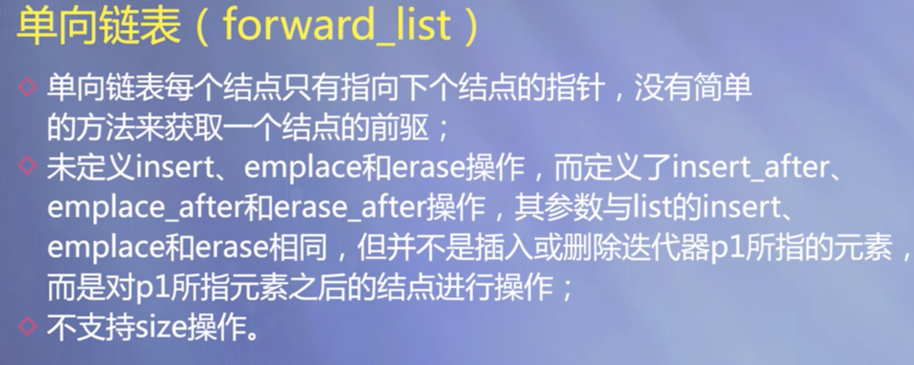

### 数组

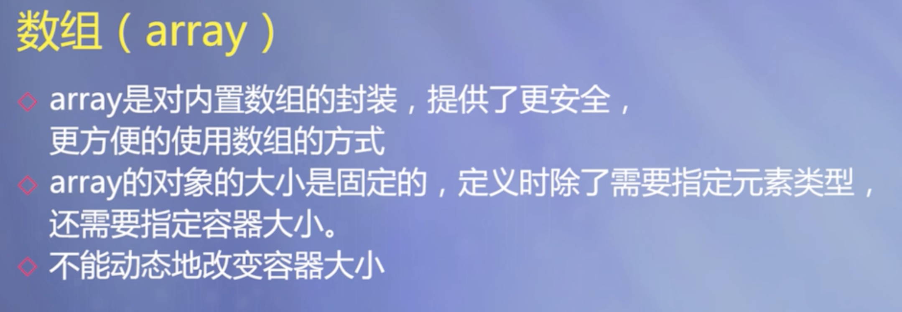

## Algorithm

````cpp
#include <algorithm>
````

#### max()、min()、abs()比较数字

#### \*max_element()、*min_element()比较容器（数组、字符串等）

```cpp
// min_element/max_element example
#include <iostream>
#include <algorithm>
using namespace std;

bool myfn(int i, int j) { return i<j; }

struct myclass {
  bool operator() (int i,int j) { return i<j; }
} myobj;

int main () {
  int myints[] = {3,7,2,5,6,4,9};

  // using default comparison:
  cout << "The smallest element is " << *min_element(myints,myints+7) << '\n';
  cout << "The largest element is "  << *max_element(myints,myints+7) << '\n';

  // using function myfn as comp:
  cout << "The smallest element is " << *min_element(myints,myints+7,myfn) << '\n';
  cout << "The largest element is "  << *max_element(myints,myints+7,myfn) << '\n';

  // using object myobj as comp:
  cout << "The smallest element is " << *min_element(myints,myints+7,myobj) << '\n';
  cout << "The largest element is "  << *max_element(myints,myints+7,myobj) << '\n';

  return 0;
}
```

#### swap()交换值

```cpp
#include <iostream>
#include <algorithm>
using namespace std;
int main()
{
    int a, b;
	swap(a, b);
    cout << a << " " << b << endl;
    int nums[4] = {0, 1, 2, 3};
    swap(nums[0], nums[3]);
    for (int i = 0; i < 3; i++)
        cout << nums[i] << " ";
    cout << endl;
    return 0;
}
```

#### reverse()翻转容器

*reverse()函数可以将一个容器直接翻转，例如数组、动态数组和字符串等*

```cpp
#include <iostream>
#include <algorithm>
#include <vector>
#include <string>
using namespace std;
int main()
{
    vector<int>array;//动态数组
    for (int i = 0; i < 5; i++)
    {
        int t;
        cin >> t;
        array.push_back(t);
    }
    reverse(array.begin(), array.end());
    for (int i = 0; i < array.size(); i++)
        cout << array[i] << " ";
    cout << endl;
    cout << "--------" << endl;
    string str = "hello world";//字符串
    reverse(str.begin(), str.end());
    cout << str << endl;
    cout << "--------" << endl;
    int arr1[101]; //数组
    for (int i = 0; i < 5; i++)
    {
        cin >> arr1[i];
    }
    reverse(arr1, arr1 + 5);
    for (int i = 0; i < 5; i++)
    {
        cout << arr1[i] << " ";
    }
    cout << endl;
    return 0;
}
```

#### 快速排序——sort函数

**默认升序**

```cpp
#include <iostream>
#include <vector>
#include <algorithm>
using namespace std;
int main()
{
    vector<int> sortv; //动态数组
    for (int i = 0; i < 5; i++)
    {
        int t;
        cin >> t;
        sortv.push_back(t);
    }
    sort(sortv.begin(), sortv.end());
    for (int i = 0; i < 5; i++)
    {
        cout << sortv[i] << endl;
    }
    //数组
    int sortnums[6];
    for (int i = 0; i < 5; i++)
        cin >> sortnums[i];
    sort(sortnums, sortnums + 5);
    for (int i = 0; i < 5; i++)
        cout << sortnums[i] << endl;
    //此sort是升序排序
    return 0;
}
```

**降序**

```cpp
在命名空间下方添加一个函数——cmp（名字任意）
  bool cmp(int a, int b)
{
    return a > b;
}
sort函数改成这样
  sort(v.begin(), v.end(), cmp);
```

### 

# C++基础

## 类型

### 类型转换


### I/O流操纵符

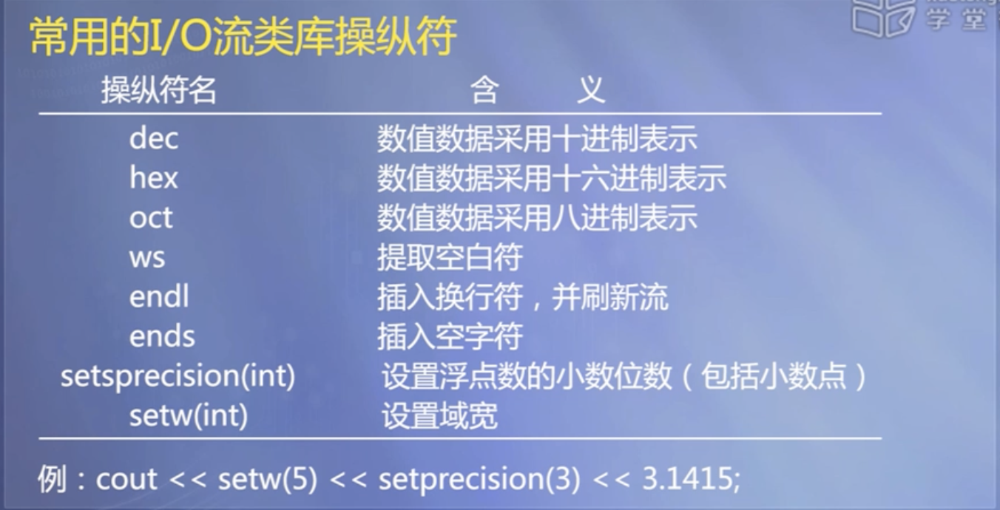

```cpp
double a=3.2001
cout<<setprecision(n)<<a;//保留n位有效数字（末尾不补0）
//n=3输出3.2
//整数位数大于n时以科学记数法输出n位有效数字
cout<<fixed<<setprecision(n)<<a;//保留n位小数（末尾会补0）
//n=3输出3.200
```

### 类型别名


### 枚举类型


### auto类型


### decltype类型


## 函数

> 万能头文件

```cpp
#include <bits/stdc++.h>
using namespace std;
```

### 二分查找

`lower_bound(first, last,val);`返回第一个大于等于val的位置/迭代器

`upper_bound(first, last,val);`返回第一个大于val的位置/迭代器

### cctype库常用函数

- **对于以下函数，如果x符合条件的话，就会返回`true`，否则返回`false`**

1. `isalpha(x)` 判断x是否为字母
2. `isdigit(x)` 判断x是否为数字
3. `islower(x)` 判断x是否为小写字母
4. `isupper(x)` 判断x是否为大写字母
5. `isalnum(x)` 判断x是否为字母或数字
6. `ispunct(x)` 判断x是否为标点符号
7. `isspace(x)` 判断x是否为空格

- `toupper(x)` 如果x是小写字母，将其转换成大写字母
- `tolower(x)` 如果x是大写字母，将其转换成小写字母

### 随机数

```c++
#include <cstdlib>
int a = rand();//生成随机数
//注意：rand()产生的是伪随机数，每次执行的结果是相同的。即上面的程序每次运行结果都一样
srand(unsigned int seed);//用来设置rand()产生随机数时的随机种子，参数seed必须是整数，如果每次seed设置都相同，rand()产生的随机数同样也相同
```

**通用公式：a+rand() % n;**		*其中：a为范围起始位置，n为整数的范围*

产生[a,b)的随机数，可以使用 (rand() % (b-a))+a;

产生[a,b]的随机数，可以使用 (rand() % (b-a+1))+a;

产生(a,b]的随机数，可以使用 (rand() % (b-a))+a+1;

### 引用

&可作为函数形参双向传递

```cpp
void swap(int& a,int& b)
{
  int t=a;
  a=b;
  b=t;
}
```

### 函数指针

**返回类型 (*指针名)(参数列表);** 

```cpp
//例：
int Add(int a, int b)
{
    return a + b;
}
int (*pFun)(int, int)=Add;
//函数指针作形参用int (*pFun)(int, int)
```

### 指针函数

***指针函数是指一个函数的返回值是一个指针，或者是一个函数的参数是一个指针。***

**返回类型* 函数名(参数列表);** 

`int* max(int a, int b)`

### getline()函数 

*用于向字符串中输入带空格的字符串*

```cpp
#include <iostream>
#include <string>
using namespace std;
string a;
getline(cin,a);//有三个参数，第三个参数为终止符号，不填默认为'\n'
```

### 时间函数

*用于计算函数/代码运行时间*

```cpp
#include <time.h>
clock_t start,stop;
double duration;
start = clock();
/*函数体*/
stop = clock();
duration=(double)(stop-start)/CLOCKS_PER_SEC;//持续时间（单位：秒）
```


### 带默认值的函数

- 可以预先设置默认的参数值，调用时如给出实参，则采用实参值，否则采用预先设置的默认参数值

- 有默认参数的形参必须列在形参列表的最右
- 如果一个函数有原型声明，且原型声明在定义之前，则默认参数值应在函数原型声明中给出；如果只有函数的定义，或函数定义在前，则默认参数值可以函数定义中给出

### 函数重载

*功能相近的函数在相同的作用域内以**相同函数名**声明，从而形成重载*

- 重载函数的形参必须不同:个数不同或类型不同

## 类

### 类定义的语法形式


### 类的成员函数


### 内联成员函数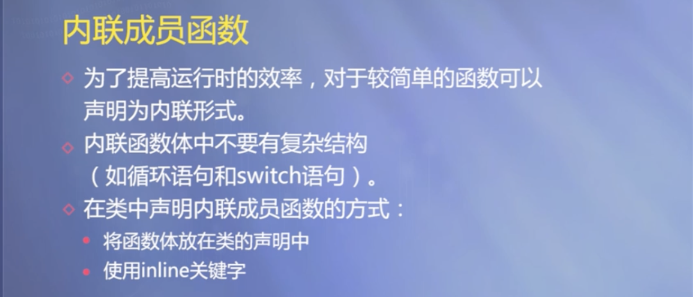

### 构造函数

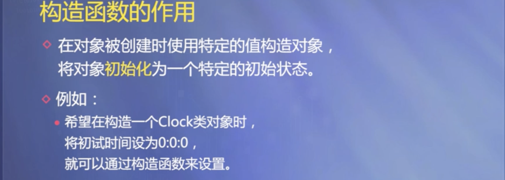


#### 委托构造函数

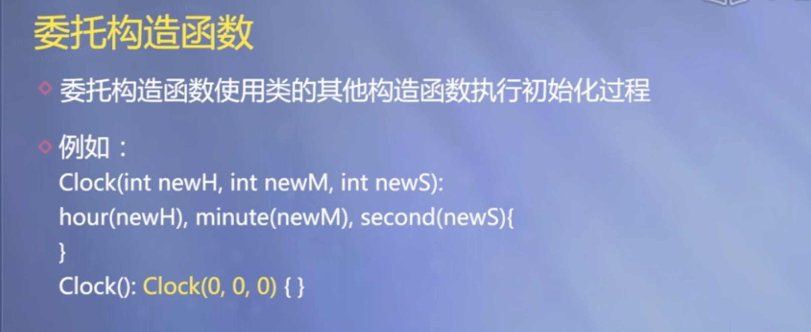

#### 复制构造函数

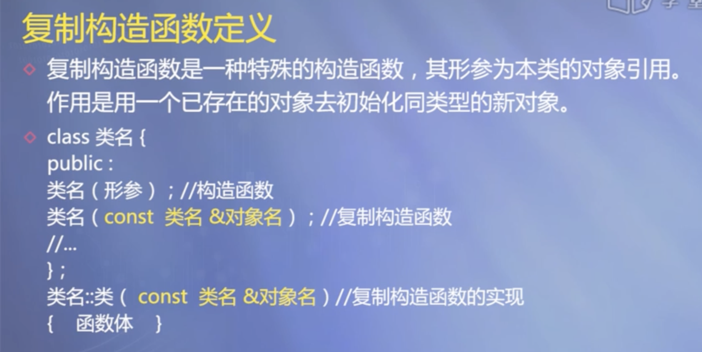 

**const&即避免传值开销又避免原数据被修改**

### 析构函数

*完成对象被删除前的一些清理工作（会默认生成）*

```cpp
～类名（）；
```

### 静态成员

#### 静态数据成员

> 其值对于所有类的实例对象都是相同的

#### 静态函数成员

> 只能访问静态数据成员和其他静态成员函数

```cpp
class MyClass {
  public:
    static int getCount() {
        return count;
    }
    static int count;
};

int MyClass::count = 0;// 静态数据成员的定义

int main() {
    std::cout << MyClass::getCount() << std::endl; // 输出 0
    return 0;
}
```

### 友元

> 可以访问该类的私有成员和受保护成员
>
> 将类作为友元即讲该类的所有函数作为友元

```cpp
class A {
    int x;

    friend void setX(A& a, int value) {
        a.x = value;
    }
};

int main() {
    A a;
    setX(a, 10); // 可以通过友元函数访问私有成员
    return 0;
}
```

## 数组、指针与字符串

### 基于范围的for循环

> **用于遍历整个容器**

```cpp
for(auto& a:array)//可以修改原数组的值
```

### 指向数组元素的指针

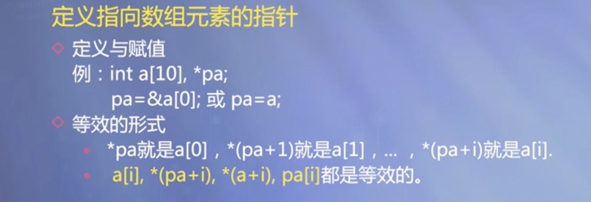

### 指针类型的函数


*返回值类型是指针（地址）*

### 指向函数的指针


*函数名也代表其地址*

### 对象指针

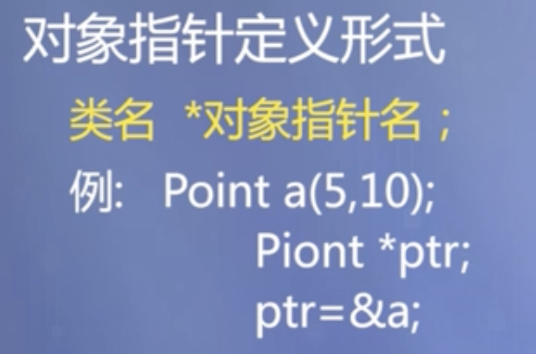


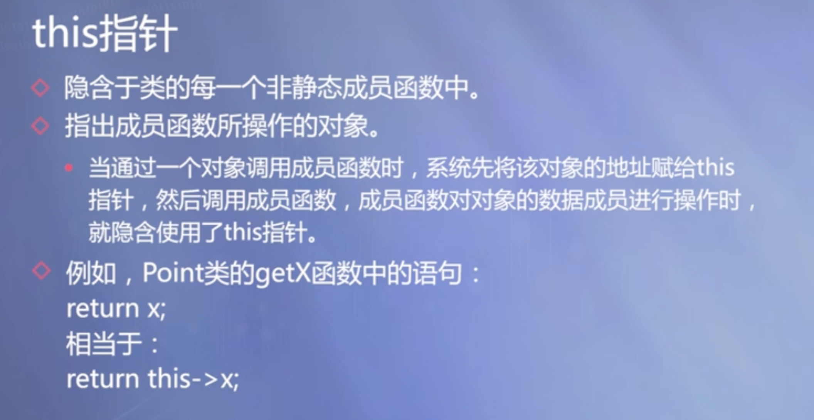

### 动态内存分配


### 智能指针

```cpp
unique_ptr<数据类型> 指针名(new 数据类型);//定义智能指针
```


### vector类


- **vector对象名不能当作数组的头指针使用**

- **函数形参应为vector<元素类型>&对象名（不加&只传值）**

### 移动构造

```cpp
对象名 ( 对象名 && 对象名 )：ptr（对象名.ptr）//&&是右值引用，右值为临时变量；ptr是指针类型
{
  对象名.ptr=nullptr
}
  
```

## 继承与派生

### 单继承


### 多继承


### 派生类的构造函数

**继承基类构造函数**`using 基类名::基类名;`


## 多态性

### 运算符重载

#### 重载为类成员的运算符函数定义形式


#### 双目运算符重载规则

```cpp
class Complex {
public:
  double real; // 实部
  double imaginary; // 虚部

  // 定义重载的运算符函数
  // 注意：这里使用了 operator+ 关键字
  Complex operator+(const Complex &other) const {
    Complex result;
    result.real = real + other.real; // 实部相加
    result.imaginary = imaginary + other.imaginary; // 虚部相加
    return result;
  }
};
```

#### 前置单目运算符重载规则

***函数返回值为\*this，参数用常引用效率高点***


#### 后置单目运算符 ++和--重载规则


**例如：**

```cpp
Clock & Clock::operator ++ () { 
    second++;
    if (second >= 60) {
        second -= 60;  minute++;
        if (minute >= 60) {
          minute -= 60; hour = (hour + 1) % 24;
        }
    }
    return *this;
}//前置++
Clock Clock::operator ++ (int) {
    //注意形参表中的整型参数
    Clock old = *this;
    ++(*this);  //调用前置“++”运算符
    return old;
}//后置++
```

### 虚函数


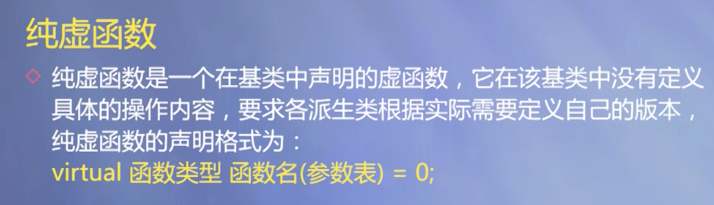

> 一个类继承了一个包含纯虚函数的类，且没有实现该纯虚函数，则该派生类也会成为抽象类，不能直接创建对象

### override

`override` 是 C++11 中新增的关键字，用于标记一个成员函数（通常是虚函数）覆盖了其基类中的同名函数。通过使用 `override` 关键字，可以明确指出派生类中的函数是用来覆盖基类中的函数的，这有助于提高代码的可读性、可维护性和安全性。

## 模板

### 函数模板

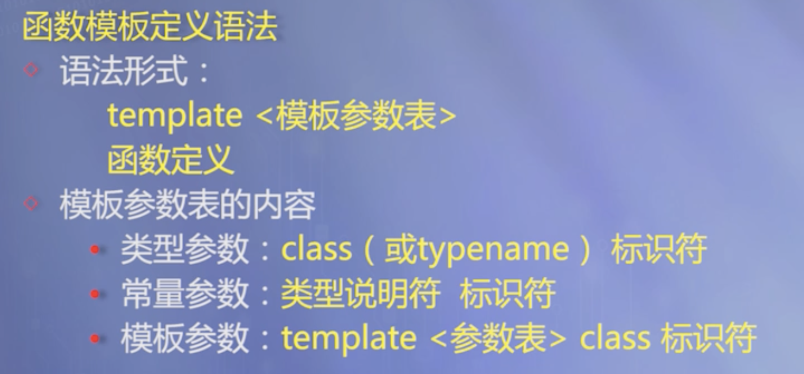

### 类模板


## 异常处理

### 异常处理语法


### 异常接口声明

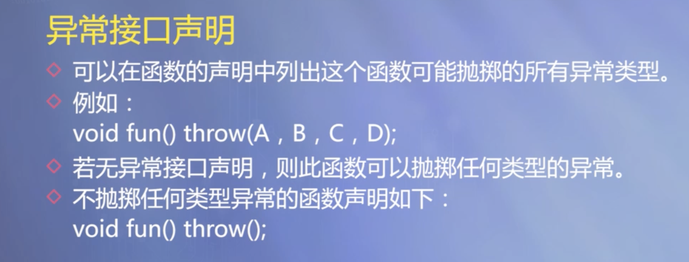
