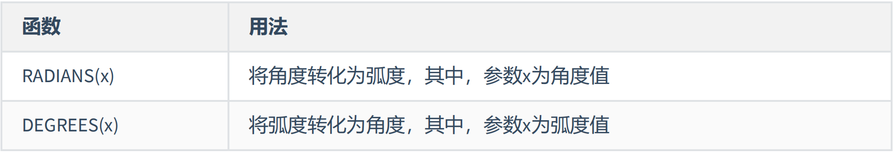
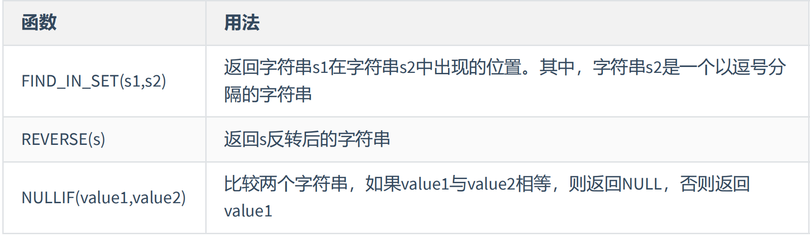
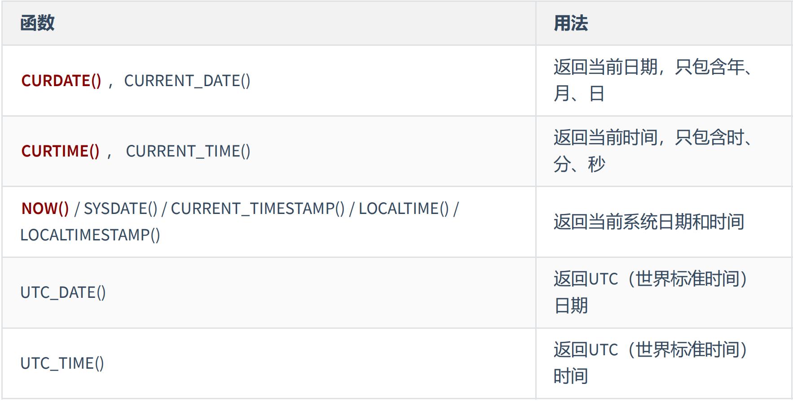
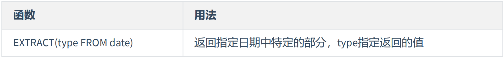
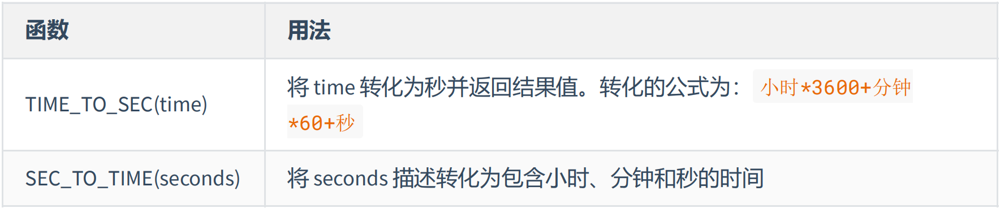
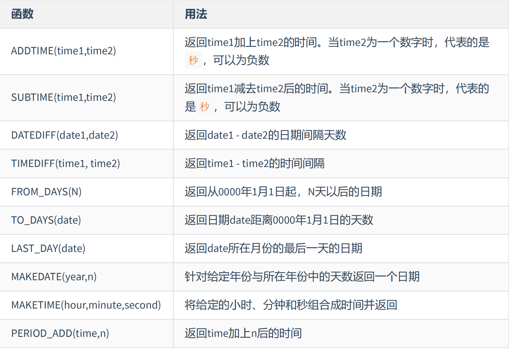
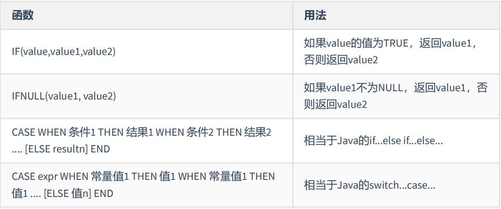
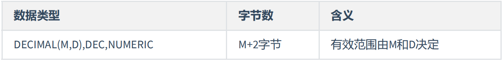
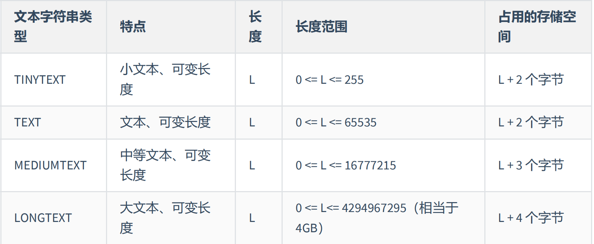
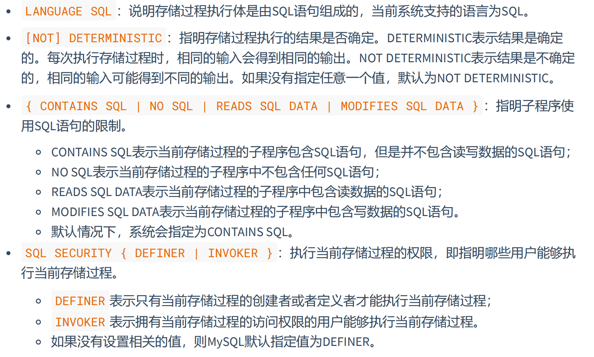

#    MySQL

[TOC]

# 查询

## 基本查询语句

```sql
SELECT 字段1,字段2,...;#SELECT 字段1,字段2,... FROM DUAL;(伪表)
SELECT 字段1,字段2,... FROM 表名;
```

### 列的别名

> 只能在ORDER BY中使用，不能在WHERE中使用

```sql
SELECT 字段 “别名” FROM 表名;
SELECT 字段 别名 FROM 表名;
SELECT 字段 AS 别名 FROM 表名;#AS:alias别名
```

### 去除重复行

```sql
SELECT DISTINCT 字段 “别名” FROM 表名;
```

### 空值参与运算

null不等于0和'null'

运算结果仍为null

解决方案：`` IFNULL(列名,替换值)``；

### 着重号

当名字与关键字冲突时用着重号`将名字框起来如：

```sql
SELECT xx FROM `order`#此处与排序关键字ORDER冲突
```

### 查询常量

```sql
SELECT '常量',字段 “别名” FROM 表名;
```

### 显示表结构

```sql
DESC 表名；#也可用DESCRIBE，显示表中字段的详细信息
```

### 过滤数据

```sql
SELECT 字段 FROM 表名 WHERE 过滤条件;
```

## 正则表达式

> 转义字符：\

### 字符

- **`. `    通配符（除换行）**

- **`\d`  数字（0-9）**

- **`\D`  非数字**

- **`\w `  字母（a-z,A-Z,0-9,_）**

- **`\W`  非字母**

- **`\s`  空白（空格，Tab，换行）**

- **`\S`  非空白**

- **`\b`  单词边界**

- **`\B`  非单词边界**

- **`^A`  以A开头**

- **`A$`  以A结尾**

- **`[字符集]`  匹配字符集中的元素（无需空格和转义）**

  **[1-7]（用-表示范围）,[12ab.],[a-zA-Z]**

- `(a|ab)`  字符组**

- `[^范围]`  ^表示取反

### 数量

> 限定前面那个字符的个数

- **`*`   0或多个**
- **`+`  1或多个**
- **`?`  0或1个**
- **`{a}`  a个**
-  **`{a,b}` a-b个**
- `{a,}`  大于a个

## 运算符

### 算术运算符

 同C++（无赋值运算符=），进行隐式类型转换（字符串数字转数值，字母转0）

### 比较运算符

```sql
= 等于
<=> 安全等于
<>或!= 不等于#可参与NULL之间比较
xx IS NULL or ISNULL(xx)
xx IS NOT NULL
LEAST(a,b,c,d,...) 返回最小值
GREATEST(a,b,c,...) 返回最大值
BETWEEN...AND... 筛选范围
IN(a,b,...) 筛选值在集合中的
NOT IN
LIKE '%a%' 筛选包含a的# %表示不确定个数的字符（a%以a开头，%a以a结尾） 
# _表示一个不确定的字符 \为转义字符
REGEXP '正则表达式'
```

### 逻辑运算符

同C++，异或：XOR

### 位运算符

同C++

## 排序和分页

### 一级排序

```sql
SELECT 字段 FROM 表名 ;（默认升序）
SELECT 字段 FROM 表名 ORDER BY 字段 ASC；#升序
SELECT 字段 FROM 表名 ORDER BY 字段 DESC;#降序
```

### 二级排序

> （多级同理）

```sql
SELECT 字段 FROM 表名 WHERE 过滤条件 ORDER BY 字段1 ASC 字段2 DESC;
```

### 分页

```sql
SELECT 字段 FROM 表名 WHERE 过滤条件 ORDER BY 字段 
#表示从偏移量开始选择指定数量,偏移量为0时可省略
#8.0新特性
LIMIT 数据数量 OFFSET 偏移量;
LIMIT 偏移量,数据数量;
```

## 多表查询

> 建议多表查询时，每个字段前都指明其所在的表

### 内连接

```sql
SELECT 表名.字段1,表名.字段2 FROM 表名1,表名2 WHERE 连接条件（表名1.x=表名2.x）;#sql 92
SELECT 表名.字段1,表名.字段2 FROM 表名1 JOIN 表名2 ON 连接条件（表名1.x=表名2.x）;#sql 99
```

> 可以表起別名，在SELECT WHERE中使用表的別名

```sql
SELECT 别名.字段1,别名.字段2 FROM 表名1 别名1,表名2 别名2 WHERE 连接条件（别名1.x=别名2.x）;#有别名只能用别名（原表名被覆盖）
```

### 外连接

> 过程中除了返回满足连接条件的行以外	还返回左/右表中不满足条件的行

```sql
SELECT 表名.字段1,表名.字段2 FROM 表名1 LEFT JOIN 表名2 ON 连接条件（表名1.x=表名2.x）;#左外连接
SELECT 表名.字段1,表名.字段2 FROM 表名1 RIGHT JOIN 表名2 ON 连接条件（表名1.x=表名2.x）;#右外连接
```

```sql
#满外连接（UNION ALL不去重，UNION去重）（左外加右空）
SELECT 表名.字段1,表名.字段2 FROM 表名1 LEFT JOIN 表名2 ON 连接条件(表名1.x=表名2.x)
UNION ALL#推荐，效率高
SELECT 表名.字段1,表名.字段2 FROM 表名1 RIGHT JOIN 表名2 ON 连接条件(表名1.x=表名2.x) 
WHERE 表名2.x IS NULL;
```

## 单行函数

### 数值函数

#### 基本函数


#### 角度与弧度互换函数



#### 三角函数


#### 指数与对数


#### 进制之间的转换


### 字符串函数

> MySQL中，字符串的位置是从1开始的




### 日期与时间函数

#### 获取日期时间



#### 日期与时间戳的转换


#### 获取月份、星期、星期数、天数等函数


#### 日期的操作函数



#### 时间与秒钟转换的函数



#### 计算日期和时间的函数




#### 日期的格式化与解析


上述**非GET_FORMAT**函数中fmt参数常用的格式符：


GET_FORMAT函数中date_type和format_type参数取值如下：


### 流程控制函数



### 加密与解密函数


### MySQL信息函数


### 其他函数


## 聚合函数

### 常见聚合函数

#### AVG和SUM函数（数值类型）

```sql
SELECT AVG(字段),SUM(字段) FROM 表名;#平均数,和
```

#### MIN和MAX函数（任意类型）

```sql
SELECT MIN(字段),MAX(字段) FROM 表名;#最小最大
```

#### COUNT函数（任意类型）

```sql
SELECT COUNT(字段) FROM 表名 WHERE 条件;#指定条件不为空的记录数目
```

### GROUP BY的使用

> 声明在FROM后面，WHERE后面，ORDER BY前面，LIMIT前面

```sql
SELECT COUNT(字段) FROM 表名 GROUP BY 字段2
```

### HAVING的使用

> 分组前用WHERE，分组后用HAVING（可同时使用）
>
> 如果过滤条件使用了聚合函数，则必须用HAVING替换WHERE，否则用WHERE
>
> HAVING必须和GROUP BY一起使用并声明在GROUP BY后面

```sql
SELECT COUNT(字段) FROM 表名 GROUP BY 字段2 HAVING 过滤条件;
```

### SELECT执行过程

#### 关键字定义顺序

```sql
SELECT ... FROM ... WHERE ... GROUP BY ... HAVING ... ORDER BY ... LIMIT...;
```

#### 执行顺序

```sql
FROM -> ON -> JOIN -> WHERE -> GROUP BY(开始使用select中的别名，后面的语句中都可以使用) -> HAVING -> SELECT 的字段 -> DISTINCT -> ORDER BY -> LIMIT;
```

## 子查询

### 单行子查询


```sql
SELECT 字段
FROM 表名
WHERE 字段 > (SELECT 字段
                FROM 表名
                WHERE 过滤条件);
```

### 多行子查询

> 查询结果为多个字段或表时字段用（）包起来


```sql
SELECT 字段
FROM 表名
WHERE 字段 < ALL (SELECT 字段
                FROM 表名
                WHERE 过滤条件);
-------------------------------                
SELECT 字段
FROM 表名
WHERE 字段 IN (SELECT 字段
                FROM 表名
                WHERE 过滤条件);
```

### 相关子查询

> 除了在GROUP BY和LIMIT都可以声明子查询

```sql
SELECT 字段
FROM 表名 别名
WHERE 字段 > (SELECT 字段
                FROM 表名
                WHERE 过滤条件（含外部表别名）);
```

#### EXISTS和NOT EXISTS

```sql
ELECT 字段
FROM 表名 别名
WHERE EXISTS (SELECT *
                FROM 表名
                WHERE 过滤条件（含外部表别名）);
```

------

# 表格

## 创建与管理表(DDL)

### 创建和管理数据库

```sql
CREATE DATABASE IF NOT EXISTS 数据库名 CHARSET utf8mb4;#创建数据库
SHOW DATABASES;#查看所有数据库
USE 数据库名;#切换数据库
SHOW TABLES;#查看当前数据库中保存的数据表
SELECT DATABASE();#查看当前使用的数据库
SHOW TABLES FROM 数据库名;#杳看指定数据库下保存的数据表
ALTER DATABASE 数据库名 CHARACTER SET 'utf8';#修改数据库字符集
DROP DATABASE IF EXISTS 数据库名;#删除数据库
```

### 创建表

 ```sql
 CREATE TABLE IF NOT EXISTS 表名(
 字段1, 数据类型 [约束条件] [默认值],
 字段2, 数据类型 [约束条件] [默认值], 
 ……
 字段n, 数据类型 [约束条件] [默认值]
 );#从0开始创建 
 CREATE TABLE 表名 AS SELECT...; #基与现有表创建
 DESC 表名;#查看表结构
 SHOW TABLES;#查看当前数据库所有表
 SHOW CREATE TABLE 表名;#查看建表语句
 ```

### 修改表

```sql
 ALTER TABLE 表名 ADD 字段名 字段类型 (FIRST||AFTER 字段);#添加字段（默认最后）
 ALTER TABLE 表名 MODIFY 字段名 字段类型;#修改字段类型（大小） 
 ALTER TABLE 表名 CHANGE 原字段名 新字段名 字段类型（可修改）;#重命名字段
 ALTER TABLE 表名 DROP COLUMN 字段名;#删除字段 
```

### 重命名表

```sql
RENAME TABLE 原表名 TO 新表名; 
ALTER TABLE 原表名 RENAME TO 新表名;
```

### 删除表

```sql
DROP TABLE IF EXISTS 表名;
```

### 清空表

> 清空数据，保留表结构
>
> TRUNCATE TABLE功能上与不带WHERE的DELETE相同

```sql
TRUNCATE TABLE 表名;#不可回滚，执行后自动commit（不推荐）
```

###  DCL中COMMIT和ROLLBACK

> commit了的数据不可修改，rollback回滚到最近一次提交后
>
> DDL执行不可回滚，DML默认不可回滚
>
> 若DML前执行了`SET autocommit=FALSE`则可回滚  

## 数据的增删改(DML)

### 插入数据

```sql
INSERT INTO 表名(column1 [, column2, …, columnn]) 
VALUES (value1 [,value2, …, valuen]);#插一条数据，未赋值的列值为空null

INSERT INTO 表名(column1 [, column2, …, columnn]) 
VALUES (value1 [,value2, …, valuen]), (value1 [,value2, …, valuen]), ……(value1 [,value2, …, valuen]);#同时插多条数据

INSERT INTO 表名(tar_column1 [, tar_column2, …, tar_columnn]) 
SELECT (src_column1 [, src_column2, …, src_columnn]) 
FROM 源表名 [WHERE 过滤条件]#通过select语句插入
```

### 更新数据

```sql
UPDATE 表名 SET 字段1 = value1，[字段2 = value2...] [WHERE 过滤条件];
```

### 删除数据

```sql
DELETE FROM 表名 [WHERE ...];
```

### 计算列

```sql
CREATE TABLE 表名( 字段1 INT,字段2 INT,
                字段3 INT GENERATED ALWAYS AS (字段1 + 字段2) VIRTUAL );
```

## 数据类型

### 整数类型

> 附加属性：UNSIGNED，ZEROFILL（左边0填充）
>
> （如果某列是ZEROFILL，那么MySQL会自动为当前列添加UNSIGNED属性）


### 浮点类型


### 定点数类型

> 开发中尽量用DECIMAL替代浮点类型



> D位小数位，M-D位整数位

### 位类型

> 使用SELECT命令查询位字段时，可以用 BIN() 或 HEX() 函数进行读取


### 时间类型

> 开发中尽量使用DATETIME


### 文本字符串类型




> 推荐VARCHAR，长度>5000用TEXT独立一张表，用索引访问

### ENUM类型


```sql
CREATE TABLE test_enum( season ENUM('春','夏','秋','冬','unknow'));
```

### SET类型

> 与enum类似，但可同时添加多个数据并去重

```sql
CREATE TABLE test_set( s SET ('A', 'B', 'C') );
```

## 约束

### 非空约束(NOT NULL)

```sql
#添加非空约束
CREATE TABLE 表名称( 字段名 数据类型, 字段名 数据类型 NOT NULL, 字段名 数据类型 NOT NULL );
alter table 表名称 modify 字段名 数据类型 not null;
#删除非空约束
alter table 表名称 modify 字段名 数据类型 NULL;
alter table 表名称 modify 字段名 数据类型;
```

### 唯一性约束(UNIQUE)

```sql
# 建表时添加唯一约束
create table 表名称( 字段名 数据类型, 字段名 数据类型 unique, 字段名 数据类型 unique key );
create table 表名称( 字段名 数据类型,字段名 数据类型, [constraint 约束名] unique(字段名) );
# 建表后添加唯一约束
alter table 表名称 add unique key(字段列表);
alter table 表名称 modify 字段名 字段类型 unique;
# 复合唯一约束
create table 表名称( 字段名 数据类型, 字段名 数据类型, 字段名 数据类型, unique key(字段列表) #字段列表中写的是多个字段名，多个字段名用逗号分隔，表示那么是复合唯一，即多个字段的组合是唯一的 );                 
# 查看都有哪些约束 
SELECT * FROM information_schema.table_constraints WHERE table_name = '表名';
# 删除唯一约束
ALTER TABLE 表名 DROP INDEX 约束名;                
```

### 主键约束(PRIMARY KEY)

> 主键约束相当于**唯一约束**+**非空约束**的组合主键约束列不允许重复也不允许出现空值

```sql
# 建表时指定主键约束
create table 表名称(
  字段名 数据类型 primary key, -- 列级模式
  字段名 数据类型, 
  字段名 数据类型 );
create table 表名称(
  字段名 数据类型, 字段名 数据类型, 
  [constraint 约束名] primary key(字段名) ); -- 表级模式
# 建表后增加主键约束
ALTER TABLE 表名称 ADD PRIMARY KEY(字段列表); -- 字段列表可以是一个字段，也可以是多个字段(复合主键)
# 关于复合主键
create table 表名称( 字段名 数据类型, 字段名 数据类型, 字段名 数据类型, 
       primary key(字段名1,字段名2) );-- 表示字段1和字段2的组合是唯一的，也可以有更多个字段
# 删除主键约束
alter table 表名称 drop primary key;-- 不需要指定主键名
```

### 自增列(AUTO_INCREMENT)

```sql
# 建表时指定自增约束
create table 表名称( 字段名 数据类型 primary key auto_increment,
                 		字段名 数据类型 unique key not null, 
                 		字段名 数据类型 not null default 默认值 );
create table 表名称( 字段名 数据类型 default 默认值 , 
                 		字段名 数据类型 unique key auto_increment, 
                 		primary key(字段名) );
# 建表后指定自增约束
alter table 表名称 modify 字段名 数据类型 auto_increment;
# 删除自增约束
alter table 表名称 modify 字段名 数据类型; #去掉auto_increment相当于删除 
```

### **CHECK** 约束(8.0支持)

```sql
create table 表名称( 字段名 数据类型 check(xxx));-- 满足条件才可添加数据
```

### 默认值约束(DEFAULT)

> 默认值约束一般不在唯一键和主键列上加 

```sql
#添加默认值约束
create table 表名称(字段名 数据类型 default 默认值);
alter table 表名称 modify 字段名 数据类型 default 默认值;
#删除默认值约束
alter table 表名称 modify 字段名 数据类型 ;-- 默认不保留非空约束
alter table 表名称 modify 字段名 数据类型 not null; -- 保留非空约束
```

# 用户权限（DCL）

## 用户管理

### 查询用户

```sql
USE mysql;
SELECT * FROM user;
```

### 创建用户

```sql
CREATE USER '用户名'@'主机名' IDENTIFIED BY '密码';
```

### 修改用户密码

```sql
ALTER USER '用户名'@'主机名' IDENTIFIED WITH mysql_native_password BY '新密码';
```

### 删除用户

```sql
DROP USER '用户名'@'主机名';
```

# 事务

> 事务是一组操作的集合，它是一个不可分割的工作单位，事务会把所有的操作作为一个整体一起向系统提交或撤销操作请求，即这些操作要么同时成功，要么同时失败

## 事务操作

### 查看/设置事务提交方式

```sql
SELECT @@autocommit; --0为手动，1为自动
SET @@autocommit=0;
```

### 开启事务

```sql
START TRANSACTION;
或
BEGIN;
```

### 提交事务

```sql
COMMIT:
```

### 回滚事务

```sql
ROLLBACK;
```

## 事务隔离

### 查看事务隔离级别

```sql
SELECT @@TRANSACTION_ISOLATION;
```

### 设置事务隔离级别

```sql
SET [SESSION | GLOBAL] TRANSACTION ISOLATION LEVEL 
{READ UNCOMMITTED | READ COMMITTED | REPEATABLE READ | SERIALIZABLE}; 
```

# 视图

> 可以将视图理解为**存储起来的** **SELECT**语句，对视图的修改将影响基表

## 创建视图

```sql
CREATE [OR REPLACE] 
[ALGORITHM = {UNDEFINED | MERGE | TEMPTABLE}] 
VIEW 视图名称 [(字段列表)] 
AS 查询语句 -- select语句可基于单表，多表联合，视图等
[WITH [CASCADED|LOCAL] CHECK OPTION]; -- 检查选项，保证对视图的修改符合视图条件
-- cascaded级联，插入看每个上级的条件，更新视图影响基表
-- local，插入只看有检查选项的条件，更新视图不影响基表
```

## 查看视图

```sql
SHOW TABLES; -- 查看数据库的表对象、视图对象
DESC / DESCRIBE 视图名称; -- 查看视图的结构
SHOW TABLE STATUS LIKE '视图名称'; -- 查看视图信息（显示数据表的存储引擎、版本、数据行数和数据大小等）
SHOW CREATE VIEW 视图名称; -- 查看视图的详细定义信息
```

## 更新视图的数据(DML)

> 视图与基表**一对一**时支持使用INSERT、UPDATE和DELETE语句(语法同DML)
>
> 当视图中的数据发生变化时，数据表中的数据也会发生变化，反之亦然

## 修改、删除视图

```sql
# 修改视图
CREATE OR REPLACE VIEW 视图名 (字段名) AS 查询语句;
ALTER VIEW 视图名称 AS 查询语句;
# 删除视图
DROP VIEW IF EXISTS 视图名称1[,视图名称2,视图名称3,...];
```

# 存储过程与函数

## 创建存储过程

> DELIMITER 新的结束标记 

```sql
CREATE PROCEDURE 存储过程名(IN|OUT|INOUT 参数名 参数类型,...) 
[characteristics ...] 
BEGIN
存储过程体 
END;
```


**characteristics:**

```sql
LANGUAGE SQL 
| [NOT] DETERMINISTIC 
| { CONTAINS SQL | NO SQL | READS SQL DATA | MODIFIES SQL DATA }
| SQL SECURITY { DEFINER | INVOKER } 
| COMMENT 'string'-- 注释信息
```



## 调用存储过程

```sql
CALL 存储过程名(实参列表);
CALL sp1('值');-- in
CALL sp1(@name); SELECT @name;-- out
SET @name=值; CALL sp1(@name); SELECT @name;-- inout
```

## 查看存储过程

```sql
SELECT * FROM INFORMATION_SCHEMA.ROUTINES WHERE ROUTINE_ SCHEMA = '数据库名';-- 查询指定数据库的存储过程及状态信息
SHOW CREATE PROCEDURE 存储过程名称;-- 查询某个存储过程的定义
```

## 删除存储过程

```sql
DROP PROCEDURE [IF EXISTS] 存储过程名称;
```

## 存储函数的使用

```sql
CREATE FUNCTION 函数名(参数名 参数类型,...)-- 可以没参数
RETURNS 返回值类型 [characteristics ...] 
BEGIN
函数体 #函数体中肯定有 RETURN 语句 
END;
```


## 调用存储函数 

```sql
SELECT 函数名(实参列表);-- 参数只能是in
```

## 存储过程和函数的查看、修改、删除

### 查看

```sql
SHOW CREATE {PROCEDURE | FUNCTION} 存储过程名或函数名;-- 查看存储过程和函数的创建信息
SHOW {PROCEDURE | FUNCTION} STATUS [LIKE 'xxx'];-- 查看存储过程和函数的状态信息
SELECT * FROM information_schema.Routines -- 查看存储过程和函数的信息
WHERE ROUTINE_NAME='存储过程或函数的名' [AND ROUTINE_TYPE = {'PROCEDURE|FUNCTION'}];
```

### 修改

> 修改存储过程或函数，不影响存储过程或函数功能，只是修改相关特性

```sql
ALTER {PROCEDURE | FUNCTION} 存储过程或函数的名 [characteristic ...];
```

### 删除

```sql
DROP {PROCEDURE | FUNCTION} [IF EXISTS] 存储过程或函数的名;
```

# 变量、流程控制与游标

## 变量

### 系统变量

> @@开头

系统变量分为全局系统变量（需要添加 global 关键字）以及会话系统变量（需要添加 session 关键

字），有时也把全局系统变量简称为全局变量，有时也把会话系统变量称为local变量。**如果不写，默认**

**会话级别。**

#### 查看所有或部分系统变量

```sql
#查看所有全局变量 
SHOW GLOBAL VARIABLES;
#查看所有会话变量 
SHOW SESSION VARIABLES;或 SHOW VARIABLES;
#查看满足条件的部分系统变量。 
SHOW GLOBAL VARIABLES LIKE '%标识符%'; 
#查看满足条件的部分会话变量 
SHOW SESSION VARIABLES LIKE '%标识符%';
```

#### 查看指定系统变量

```sql
#查看指定的系统变量的值 
SELECT @@global.变量名; 
#查看指定的会话变量的值 
SELECT @@session.变量名;或 SELECT @@变量名;
```

#### 修改系统变量的值

```sql
SET @@global.变量名=变量值; 
SET GLOBAL 变量名=变量值;  
SET @@session.变量名=变量值;
SET SESSION 变量名=变量值;
```

### 用户变量 

> @开头
>
> 根据作用范围不同，又分为 会话用户变量 和 局部变量 。


#### 会话用户变量

```sql
SET @用户变量 = 值;或 SET @用户变量 := 值;
SELECT @用户变量 := 表达式 [FROM 等子句];或 SELECT 表达式 INTO @用户变量 [FROM 等子句];
SELECT @用户变量;-- 查看用户变量的值 （查看、比较、运算等）
```

#### 局部变量

> 定义：可以使用 DECLARE 语句定义一个局部变量
>
> 作用域：仅仅在定义它的 BEGIN ... END 中有效
>
> 位置：只能放在 BEGIN ... END 中，而且只能放在第一句

```sql
BEGIN
	#声明局部变量 
	DECLARE 变量名1 变量数据类型 [DEFAULT 变量默认值];
  DECLARE 变量名2,变量名3,... 变量数据类型 [DEFAULT 变量默认值]; 
  #为局部变量赋值 
  SET 变量名1 = 值; SELECT 值 INTO 变量名2 [FROM 子句]; 
  #查看局部变量的值 
  SELECT 变量1,变量2,变量3; 
END
```

## 流程控制

### 分支结构之IF 

```sql
IF 表达式1 THEN 操作1;
[ELSEIF 表达式2 THEN 操作2;]
…… 
[ELSE 操作N;] 
END IF;
```

### 分支结构之CASE

```sql
#情况一：类似于switch 
CASE 表达式 
WHEN 值1 THEN 结果1或语句1(如果是语句，需要加分号) 
WHEN 值2 THEN 结果2或语句2(如果是语句，需要加分号) 
... 
ELSE 结果n或语句n(如果是语句，需要加分号) 
END [case]（如果是放在begin end中需要加上case，如果放在select后面不需要）
#情况二：类似于多重if 
CASE 
WHEN 条件1 THEN 结果1或语句1(如果是语句，需要加分号) 
WHEN 条件2 THEN 结果2或语句2(如果是语句，需要加分号) 
... 
ELSE 结果n或语句n(如果是语句，需要加分号) 
END [case]（如果是放在begin end中需要加上case，如果放在select后面不需要）
```

### 循环结构之LOOP

```sql
[loop_label:] LOOP 
	循环执行的语句 
END LOOP [loop_label];-- loop_label表示LOOP语句的标注名称，该参数可以省略
```

### 循环结构之WHILE

```sql
[while_label:] WHILE 循环条件 DO
	循环体 
END WHILE [while_label];-- while_label为WHILE语句的标注名称,该参数可以省略
```

### 循环结构之REPEAT

```sql
[repeat_label:] REPEAT
	循环体的语句 
UNTIL 结束循环的条件表达式 
END REPEAT [repeat_label];-- repeat_label为REPEAT语句的标注名称，该参数可以省略
```

> 这三种循环都可以省略名称，但如果循环中添加了循环控制语句（LEAVE或ITERATE）则必须添加名称

### 跳转语句之LEAVE语句

> 类似于break

```sql
LEAVE 标记名;
```

### 跳转语句之ITERATE语句

> 类似于continue

```sql
ITERATE label;
```

## 游标

> 相当于指针 

### 使用游标步骤

1. 声明游标

   ```sql
   DECLARE 游标名 CURSOR FOR 查询语句;
   ```

2. 打开游标

   ```sql
   OPEN 游标名;
   ```

3. 使用游标（从游标中取得数据）

   ```sql
   FETCH cursor_name INTO var_name [, var_name] ...
   -- 游标的查询结果集中的字段数，必须跟 INTO 后面的变量数一致
   ```

4. 关闭游标

   ```sql
   CLOSE 游标名;
   ```

# 触发器

> 当对数据表中的数据执行插入、更新和删除操作，需要自动执行一些数据库逻辑时，可以使用触发器来实现

### 触发器的创建

```sql
CREATE TRIGGER 触发器名称 
{BEFORE|AFTER} {INSERT|UPDATE|DELETE} ON 表名 -- 使用NEW/OLD.字段访问操作前后的字段值
FOR EACH ROW 
触发器执行的语句块;-- 可以是单条SQL语句，也可以是由BEGIN…END结构组成的复合语句块
```

###  查看触发器

```sql
SHOW TRIGGERS;-- 查看当前数据库的所有触发器的定义
SHOW CREATE TRIGGER 触发器名;-- 查看当前数据库中某个触发器的定义
SELECT * FROM information_schema.TRIGGERS;-- 从系统库information_schema的TRIGGERS表中查询触发器的信息
```

### 删除触发器

```sql
DROP TRIGGER IF EXISTS 触发器名称;
```

# MySQL8其它新特性

## 窗口函数


```sql
select 窗口函数 OVER（[PARTITION BY 字段名 ORDER BY 字段名 ASC|DESC]）,... from xx;
或
select 窗口函数 OVER 窗口名 
… 
WINDOW 窗口名 AS （[PARTITION BY 字段名 ORDER BY 字段名 ASC|DESC]）
```

## 公用表表达式

### 普通公用表表达式

```sql
WITH CTE名称 
AS （子查询） 
SELECT|DELETE|UPDATE 语句;
```

### 递归公用表表达式

```sql
WITH RECURSIVE CTE名称 
AS （子查询） 
SELECT|DELETE|UPDATE 语句;
```

# 存储引擎

> 存储引擎基于表

## 查看当前数据库支持的存储引擎

```sql
SHOW ENGINES;
```

## 指定表存储引擎

```sql
CREATE TABLE 表名(字段名 类型...)engine=xxx; --默认为InnoDB
```

# 索引

> 索引分为主键索引，唯一索引，常规索引
>
> InnoDB的索引为B+树索引

## 创建索引

```sql
CREATE [UNIQUE|FULLTEXT] INDEX 索引名 ON 表名 (字段名...);
-- 不指定索引类型则为常规索引，可同时为多个字段建立联合索引
```

## 查看索引

```sql
SHOW INDEX FROM 表名;
```

## 删除索引

```sql
DROP INDEX 索引名 ON 表名;
```

## 使用规则

1. 最左前缀法则：使用**联合索引**必须存在最左侧的字段，跳过中间字段后面的字段索引失效

2. 范围查询： 所以**联合索引**时使用>或<字段后面的字段索引生效，可用>=和<=规避

3. 索引列运算：不要在索引列上运算（函数），索引会失效

4. 字符串不加引号：字符串不加' '索引失效

5. 模糊查询：头部模糊匹配索引失效，尾部不会

6. or连接的条件：如果or任一侧没有索引，索引失效

7. 数据发布影响：如果mysql评估索引比全表慢，则不走索引

8. SQL提示：指定索引

   ```sql
   explain select xx from 表名 use index(索引名)...;		-- 建议索引
   explain select xx from 表名 ignore index(索引名)...; -- 忽略索引
   explain select xx from 表名 use index(索引名)...;    -- 强制索引
   ```

9. 覆盖索引：查询返回的字段尽量为主键和索引字段，避免回表查询

10. 前缀索引：当字段为字符串时，使用部分前缀作为索引提高索引效率

    ```sql
    create index 索引名 on 表名(字段(n)); -- 以字段的前n个字符建立索引
    ```

11. 单列索引和联合索引：尽量使用联合索引，减少回表查询

# 性能分析

## 查看SQL执行频率

```sql
SHOW GLOBAL STATUS LIKE 'Com_______';  -- (7个_)
```

## 慢查询日志

```bash
vim /etc/my.cnf
#添加下面的配置:
slow_query_log=1 	#开启MySQL慢日志查询开关
long_query_time=2 #SQL语句执行时间超过2秒，就会视为慢查询，记录慢查询日志

#重启mysql服务
systemctl restart mysqld 
```

> 查看慢日志文件中记录的信息:	/var/lib/mysql/主机名-slow.log

## profile

```sql
SELECT @@have_profiling;	-- 查看当前数据库是否支持profile
SET profiling = 1;				-- 开启profiling
SHOW profiles;						-- 查看每条sql语句耗时
```

## explain执行计划

> 在select语句前加explain

### explain字段解释：

1. **id：** id越大越先执行，id相同从上到下执行
2. *select_type*:  查询类型
3. **type:**  表示连接类型，性能NULL>system>const>eq_ref>ref>range>index>all
4. possible_key:   可能用到的索引
5. key： 实际用到的索引
6. key_len:  索引中使用的字节数，**越短越好**
7. **rows:**  必须要执行查询的行数 (估计值)
8. filtered:  表示返回结果的行数占需读取行数的百分比，**越大越好**

# SQL优化

## 插入优化

1. 批量插入

2. 手动事务提交

3. 主键顺序插入

4. 大批量数据插入用**load**

   ```sql
   mysql --local-infile -u root -p
   set global local_infile=1;
   load data local infile '文件路径' into table '表名' fields terminated by '字段分隔符' lines terminated by '行分隔符';
   ```

## 主键优化

1. 页分裂
2. 页合并
3. 尽量降低主键长度
4. 尽量使用顺序插入，使用自增主键
5. 尽量修改主键

## order by优化

1. 使用索引提高效率（using index > using filesort)
2. 尽量覆盖查询，否则索引失效
3. 索引默认升序ASC，如**多字段排序**某个字段需倒序DESC在创建索引时字段后面加上desc

## group by优化

使用索引提高效率（using index > using temporary)

## limit优化

可以通过覆盖索引加子查询形式进行优化

## count优化

count(*)性能最高

## update优化

根据索引字段更新，否则出现行锁升级为表锁影响并发性能

# 锁

## 全局锁

```sql
flush tables with read lock; -- 加锁
unlock tables; -- 解锁
```

## 备份数据库

> mysqldump为**shell**命令

```shell
# 1.备份前需加锁
mysqldump [-h 主机IP地址] -u用户名 -p密码 数据库名 > xxx.sql; #备份当前数据库到xxx.sql

# 2.不加锁，快照读
mysqldump --single-transaction [-h 主机IP地址] -u用户名 -p密码 数据库名 > xxx.sql;
```

## 表级锁

### 表锁

1. 表共享读锁(read lock)：可读不可写

2. 表独占写锁(write lock)：当前客户端可以读写，其他客户端不可读写

```sql
lock tables 表名 read/write; -- 加锁
unlock tables; -- 解锁
```

### 元数据锁(自动)

> 防止DML与DDL语句冲突
>
> 当对一张表进行增删改查的时候，加MDL读锁(共享)；当对表结构进行变更操作的时候，加MDL写锁(排他)

### 意向锁

> 解决行锁和表锁冲突问题

1. 意向共享锁(IS)：select ... lock in share mode;加上行锁和表的意向锁

2. 意向排他锁(IX)：update时自动添加

## 行级锁

### 行锁

> 针对唯一索引进行检索时，对已存在的记录进行等值匹配时，将会自动优化为行锁
>
> InnoDB的行锁是针对于索引（加的锁，不通过索引条件检索数据，此时就会升级为表锁

1. 共享锁(S)：允许一个事务去读一行，阻止其他事务获得相同数据集的排它锁
2. 排他锁(X)：允许获取排他锁的事务更新数据，阻止其他事务获得相同数据集的共享锁和排他锁


### 间隙锁&临键锁（自动）

> 临键锁=行锁+间隙锁

1. 索引上的等值查询(唯一索引)，给不存在的记录加锁时，优化为间隙锁
2. 素引上的等值查询(普通索引)，向右遍历时最后一个值不满足查询需求时，next-key lock 退化为间隙锁
3. 索引上的范国查询(唯一索引)，会访问到不满足条件的第一个值为止
